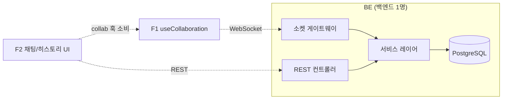

# MarkFlow 역할 분담 (Team Roles)

| 항목 | 내용 |
| --- | --- |
| 문서 유형 | 역할 분담 / 협업 가이드 |
| 프로젝트 | MarkFlow — 마크다운 노드 기반 실시간 협업 캔버스 |
| 버전 / 상태 | v1.1 / Draft (3인 체제 반영) |
| 팀 / 기간 | 3인 (백엔드 1 · 프론트 2) / 4주 |
| 작성일 | 2026-06-25 |

> 한 줄 정의 — **BE 1명이 백엔드 전체(소켓 + REST + 도메인)**, 프론트는 **F1 캔버스/실시간 ↔ F2 셸/콘텐츠**로 가른다. BE가 단독 크리티컬 패스이므로, 1주차에 계약(스키마·DTO·서비스)을 최우선으로 내주고 FE 둘이 그 위에서 병렬 진행한다.

---

## 0. 구성 한눈에

| 코드 | 역할 | 핵심 영역 | 주 협업 |
| --- | --- | --- | --- |
| **BE** | 백엔드 전체 | Prisma·서비스·REST·권한 **+ Socket.io 게이트웨이·동기화·락·프레즌스** | F1·F2 |
| **F1** | 프론트 · 캔버스/실시간 | React Flow·노드·`useCollaboration`·멀티커서·소프트락 | BE |
| **F2** | 프론트 · 셸/콘텐츠/패널 | 인증·프로젝트·MD에디터·채팅/히스토리 UI | BE |

> 기존 백엔드 2명(B1 소켓 · B2 도메인)을 **BE 1명으로 통합**. 소켓과 도메인을 한 사람이 맡되, 서비스 레이어 seam 덕분에 소켓·REST가 같은 로직을 공유한다.

---

## 1. 백엔드 — BE (1명)

기존 B1(소켓) + B2(도메인)을 통합. **서비스 레이어를 먼저** 만들면 REST·소켓이 그대로 재사용한다.

**도메인/REST**
- **Prisma 스키마 + 마이그레이션 (단일 소유)**
- 인증(JWT)·프로젝트·멤버/권한·노드/엣지/채팅/활동로그 **서비스 + REST**
- 휴지통(소프트삭제·복구·영구삭제), 공유 권한 헬퍼 `assertPermission`

**실시간/소켓**
- Socket.io 서버·JWT 핸드셰이크, 룸(`project:<id>`) 입장·`sync:init`/`sync:resync`
- `cursor:move`(≈50ms), `node:*`·`edge:*` 동기화 broadcast(서비스 재사용), 소프트 락, 채팅 broadcast
- 이벤트별 권한 재검사, 잔버그 3종(초기싱크·재접속·순서) 안정화

**폴더**: `prisma/` · `modules/*` · `shared/*` · `realtime/*` (즉 `apps/api` 전체)

---

## 2. 프론트엔드

### 🎨 F1 — 캔버스 & 실시간
- React Flow 캔버스(팬/줌/미니맵/fitView), 커스텀 MD 노드 카드(접기/펼치기)
- 노드 생성·이동·연결·휴지통 드래그드롭
- **`useCollaboration`(CollabAPI) 소유**, 소켓 클라이언트, 멀티커서·소프트락 UI, 초기싱크/재접속
- **Zustand nodes/edges 스토어 소유**, debounce 저장
- 폴더: `features/canvas`, `collab/*`, `store/canvas,presence`

### 🧩 F2 — 셸 & 콘텐츠 & 패널
- 공용: 헤더/푸터/라우팅·인증 가드·**API 클라이언트(토큰·401 인터셉터)**
- 랜딩·로그인/회원가입·프로젝트 리스트(생성·삭제(하드)·rename)
- 노드 상세 에디터(전체화면 @uiw/react-md-editor)
- 우측 패널(팀 채팅 탭·히스토리 탭) + 우하단 채팅 FAB
- 폴더: `features/auth,projects,node-editor,panel,trash`, `lib/api`

---

## 3. 경계(seam) — 협업 접합면

- **백엔드 seam = 서비스 레이어**(BE 내부): 소켓 핸들러·REST 컨트롤러가 같은 `nodeService.create()` 호출 → 로직·권한·로그 단일화. *소켓·도메인을 한 사람이 맡아도 중복 구현이 없도록 하는 장치.*
- **프론트 seam = CollabAPI**: F1이 `useCollaboration` 소유, F2는 그걸 가져다 채팅·프레즌스 UI를 그림.

---

## 4. Day 1 합의 — 4대 계약

BE가 1일차에 아래를 확정·제공해야 FE 둘이 막힘없이 병렬 진행한다.

| # | 계약 | 소유 | 사용 |
| --- | --- | --- | --- |
| 1 | **Prisma 스키마** (`08-ERD.md`/`.dbml` 기준) | BE | 전원 |
| 2 | **`assertPermission(projectId, userId, minRole)`** | BE | BE |
| 3 | **서비스 시그니처** (node/edge/chat/activity) | BE | BE |
| 4 | **DTO 타입 + CollabAPI 인터페이스** | BE(DTO)·F1(CollabAPI) | 전원 |

---

## 5. 주차별 진행 (4주)

| 주차 | BE (백엔드 전체) | F1 (캔버스/실시간) | F2 (셸/콘텐츠) |
| --- | --- | --- | --- |
| 1주 | **스키마·DTO·서비스 스텁**·인증·프로젝트 REST | React Flow·노드 카드·store(로컬 CRUD) | API 클라이언트·인증·프로젝트 리스트 |
| 2주 | 노드/엣지 REST·저장·휴지통·영구삭제·활동로그 | 캔버스↔DB 연동·휴지통 드래그·debounce 저장 | MD 상세 에디터 (프로젝트는 하드 삭제 — 휴지통 없음) |
| 3주 | **Socket.io 서버·동기화·소프트락·채팅·재접속** | **소켓 클라·멀티커서·소프트락 UI** | **채팅·히스토리 패널**(collab 훅 소비) |
| 4주 | 히스토리 API·권한 양면·잔버그 안정화 | 캔버스 성능·실시간 마감 | 히스토리 탭·랜딩·권한별 UI |

> **의존성**: F1·F2는 BE의 스키마·서비스·DTO가 나와야 통합한다. → **BE가 1주차에 계약(스키마+서비스 스텁+DTO)을 최우선 제공**. 그 전까지 F1은 로컬 state 캔버스, F2는 셸·토큰부터 선행.
> **부하**: BE 단독이므로 3주차 소켓이 병목 → **F1이 소켓 클라이언트/오버레이를 분담**, 막히면 Liveblocks 차선(CollabAPI 뒤) 전환. P2(채팅 FAB 등)는 후순위.

상세 일정·이슈는 **Linear**(IEUM)에서 관리.

---

## 6. 리스크 분담 (요약)

| 리스크 | 1차 대응 담당 |
| --- | --- |
| 실시간 디버깅 지연 | BE / F1 (막히면 Liveblocks 차선 전환) |
| BE 단독 병목 | BE 1주차 계약 우선·F1 소켓 분담·P2 후순위 |
| 권한 우회 | BE (REST+Socket 양면 가드) |
| 캔버스 성능 | F1 (노드 가상화) |
| 영구삭제 사고 | F2 확인 모달 / BE 권한 제한 |

상세 → `05-Tech-Spec.md §11`.

---

## 관련 문서

- 백엔드 아키텍처 — `06-Backend-Architecture.md`
- 프론트엔드 아키텍처 — `07-Frontend-Architecture.md`
- 일정·이슈 — **Linear** (IEUM)
- 기술 설명서 — `05-Tech-Spec.md` / 기능정의서 — `03-Feature-Spec.md`
- API 명세서 — `09-API-Spec.md` / 데이터 모델 — `08-ERD.md`
